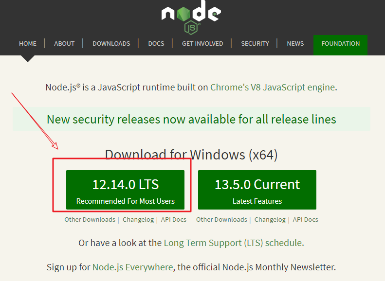
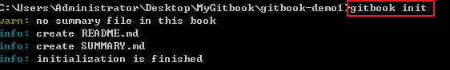
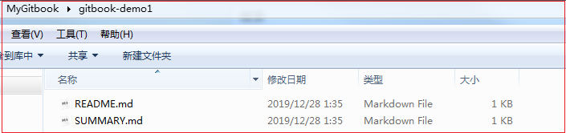
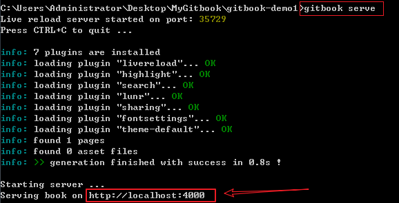
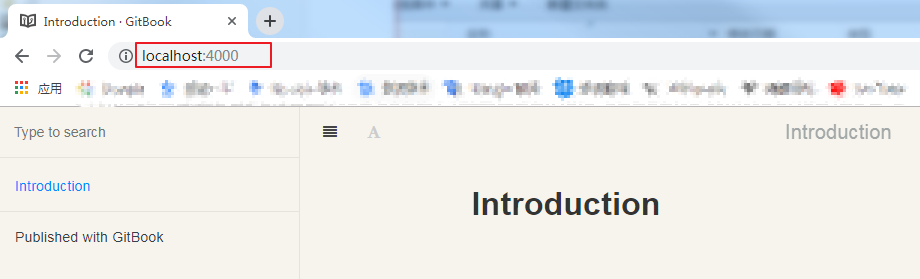
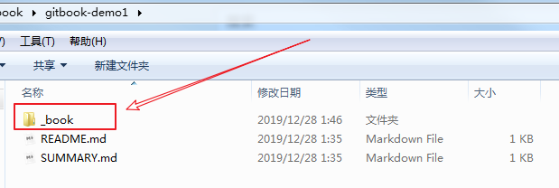

## 1. gitbook 安装和基本使用

### 1.1 gitbook安装

1.安装 Node.js

<https://nodejs.org/en/>



2.通过npm安装gitbook

```shell
npm install gitbook-cli -g
```

3.安装完成可以查看gitbook版本

```shell
gitbook -V
```

### 1.2 gitbook基本使用

**1.初始化数据目录**  

```shell
gitbook init
```



> 执行完成后会在当前目录生成README.md 和 SUMMARY.md文件
>
> README.md 和 SUMMARY.md 是两个必须文件
>
> README.md 是对书籍的简单介绍
>
> SUMMARY.md 是书籍的目录结构



**2.编译和预览书籍**

```shell
gitbook serve
```

> 注: `gitbook serve` 命令实际上会首先调用 `gitbook build` 编译书籍，完成以后会打开一个 web 服务器，监听在本地的 4000 端口



使用浏览器打开该链接可以看到初始内容：



并且在本地生成了 `_book` 文件夹：

