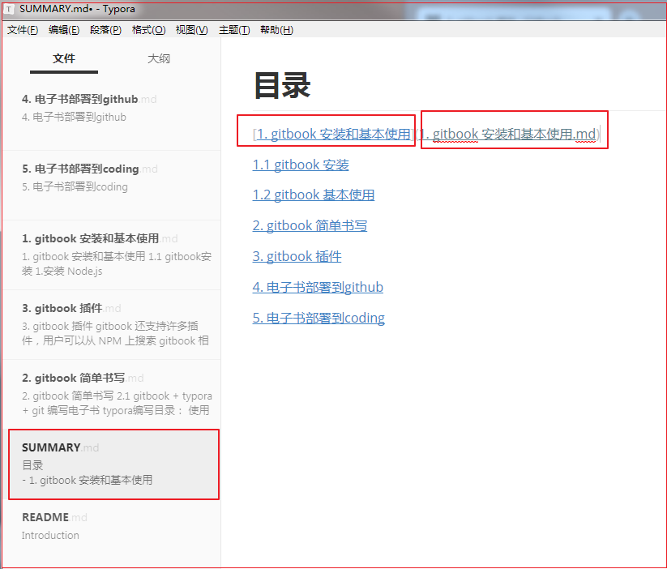
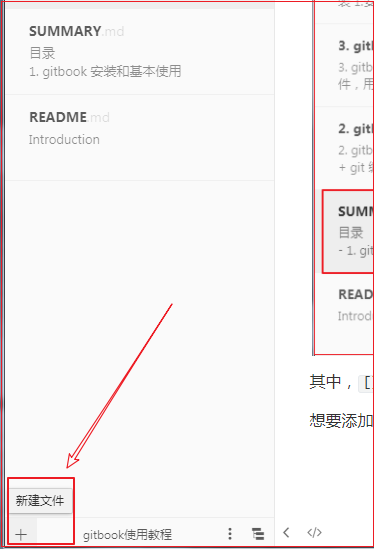
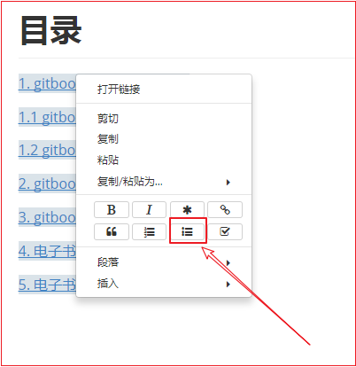
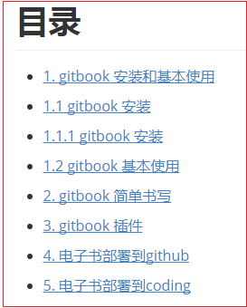
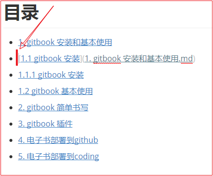
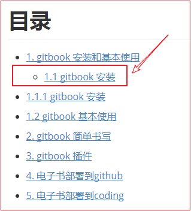
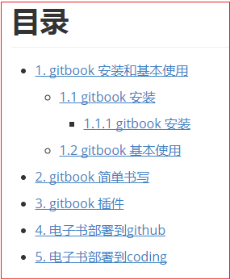
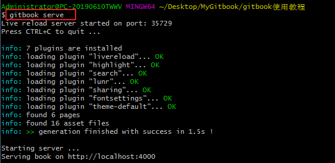

## 2. gitbook 简单书写

### 2.1 gitbook + typora + git 编写电子书

**typora编写目录：**

> 使用typora打开整个电子书文件夹，编写SUMMARY.md目录文件：

> 其中，`[]`中括号内的内容为目录项内容，`()`中的内容为目录项链接的.md文件。
>
> 想要添加文件，直接点击左下角的`+`添加.md文件，命名相应名称即可。

> 目录内容写好后，需要区分一、二、三级标题。
>
> 右键选择内容，选择无序列表选项设置为一级标题：

> 设置完成后，如下图效果：

> 若有二级标题需要设置，只需要在要设置的标题前面进行缩进 (Tab键) 即可：

> 设置二级标题后如下：

> 同样的，三级标题是在二级标题的基础上，再次缩进：

目录内容编辑完成后，使用 git 进行编译，并在本地浏览器查看：

