## 4. 电子书部署到github

> 下载Git软件：<https://git-scm.com/downloads>
>
> master 分支保存书籍的源码
>
> gh-pages 分支保存书籍编译后的HTML文件

### 4.1 github 官网创建远程仓库

打开github官网：[https://github.com](https://github.com/) ，新建一个远程仓库：

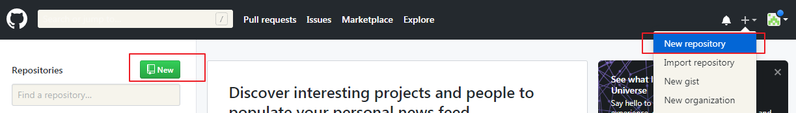

对仓库命名并添加简单描述：

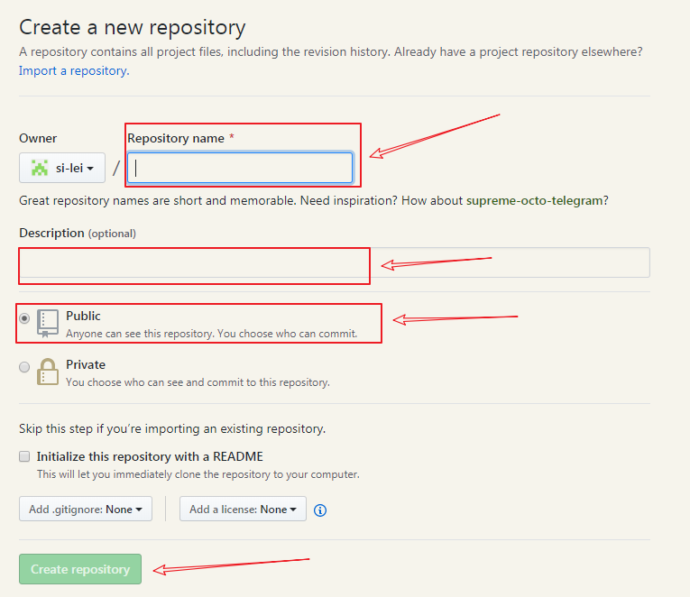

仓库新建完成：

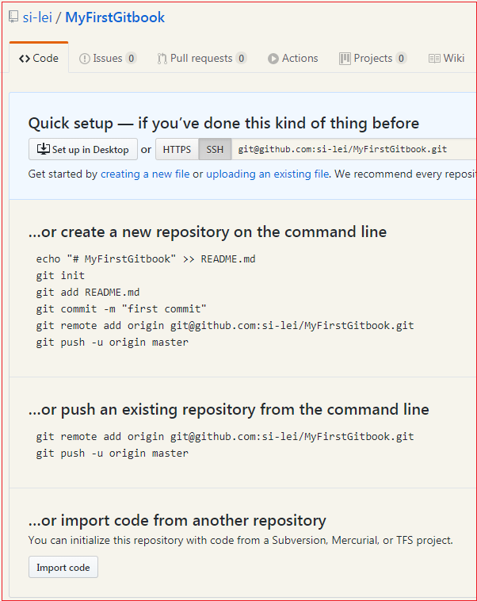

### 4.2 使用git上传至远程仓库

1.在电子书文件目录下，使用git bash打开，并使用git初始化目录文件：

```shell
git init
```

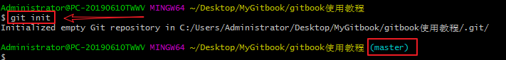

> git初始化完成后，可以看到该路径下多了一个master分支，并且生成了.git文件:

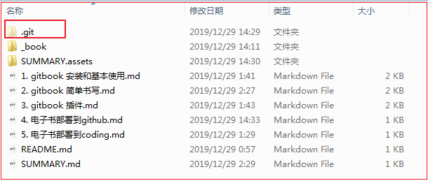

2. 在git中添加远程仓库：

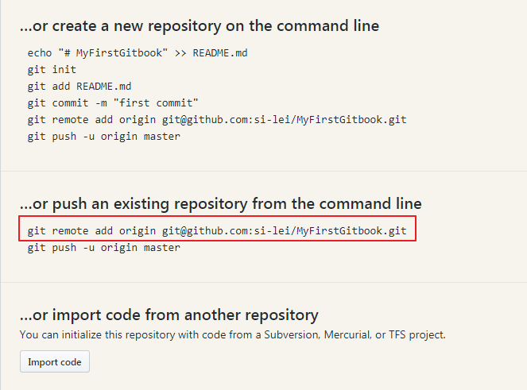

```shell
git remote add origin git@github.com:si-lei/MyFirstGitbook.git
```

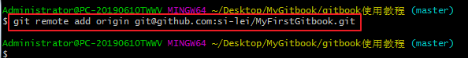

3.将新建的文件添加至git本地仓库：

```shell
git add .
```

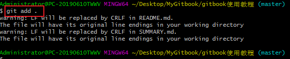

4.使用git提交内容到本地仓库：

```shell
git commit -m '第一次提交gitbook'
#''中的内容是提交的备注信息
```

> 第一次提交若出现Please tell me who you are的情况，按照提示输入自己的邮箱和用户名即可：

```shell
git config --global user.email  "695171452@qq.com"
git config --global user.name "si-lei"
```

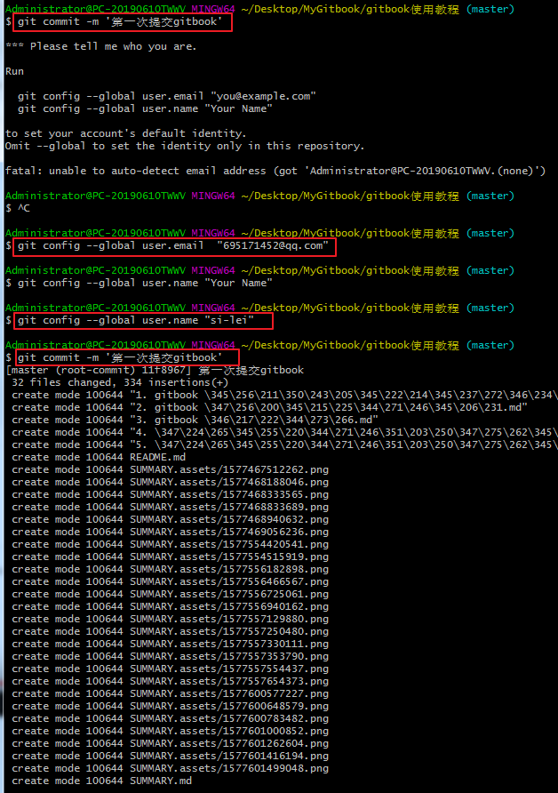

5.push到远程仓库的master分支：

```shell
git push -u origin master	#第一次push需要添加-u参数，以后就不用添加此参数了
```

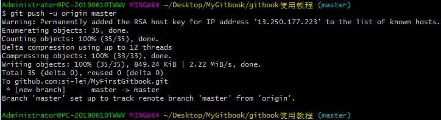

> 推送到远程仓库后可以看到如下内容：

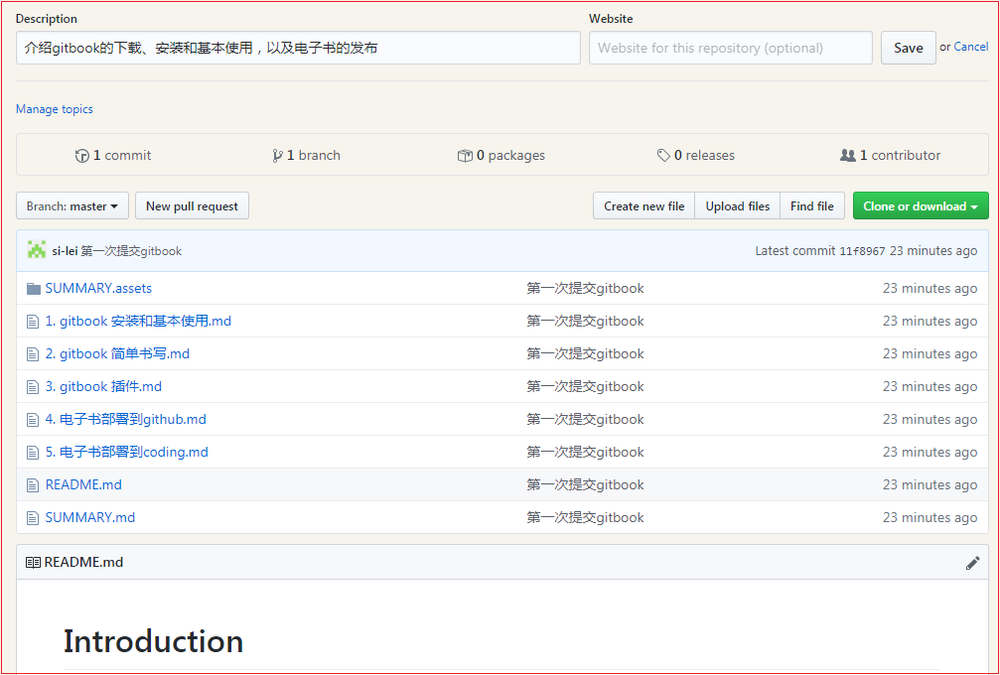

6.新建文件夹gh-pages保存书籍编译后的html文件，并以gh-pages分支上传至远程仓库：

> 注意：必须要gh-pages分支，到时才能生成网页链接。

> 在新建gh-pages目录下用git执行以下命令：

```shell
git init				#git初始化目录
git checkout -b gh-pages	#从master切换至pages分支

#将原来目录下的_book内容，拷贝至pages目录下，再执行以下命令：
git add .				#将新添加的文件添加至本地仓库
git commit -m "第一次提交gh-pages分支"	#提交至本地仓库

#与远程仓库MyFirstGitbook关联：
git remote add origin git@github.com:si-lei/MyFirstGitbook.git	
git push origin gh-pages	#推送至远程仓库的pages分支
```

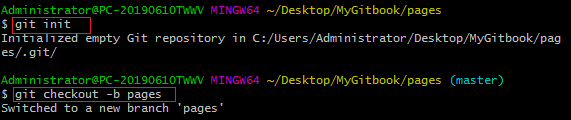

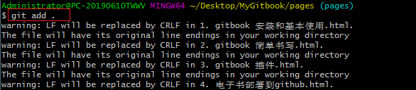

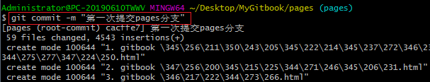

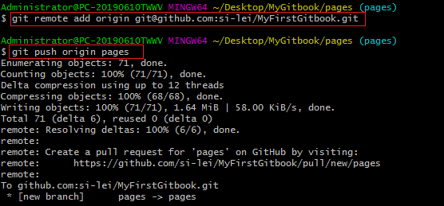

> 提交完成后，在远程仓库的gh-pages分支可以看到如下内容：

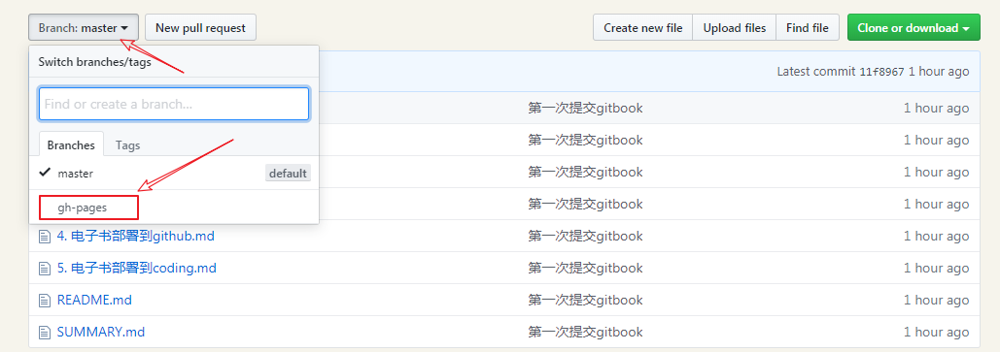

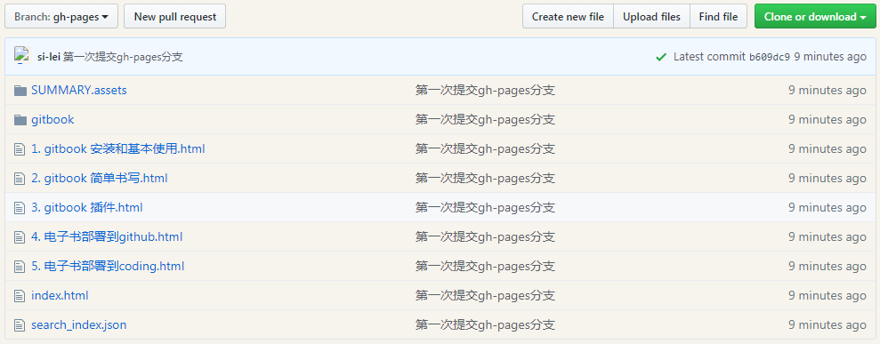

7.查看生成的网页内容：

> 点击Settings:

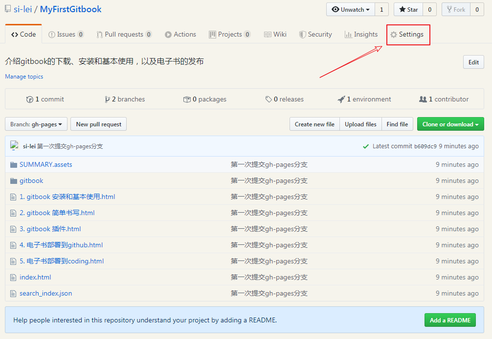

> 下拉至GitHub Pages查看：

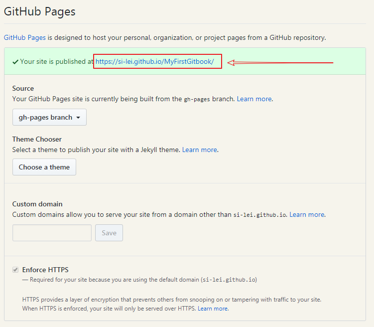

> 在浏览器中打开此链接即可查看到电子书内容：

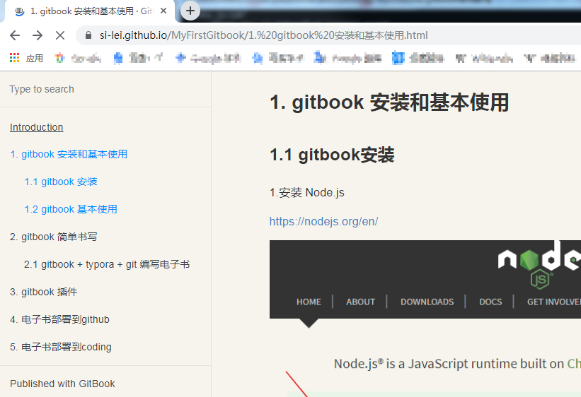

