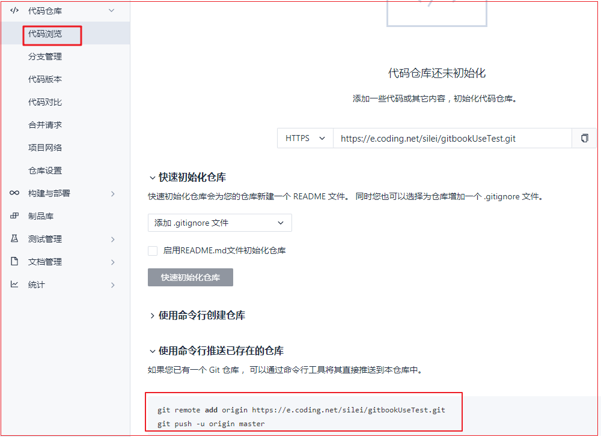
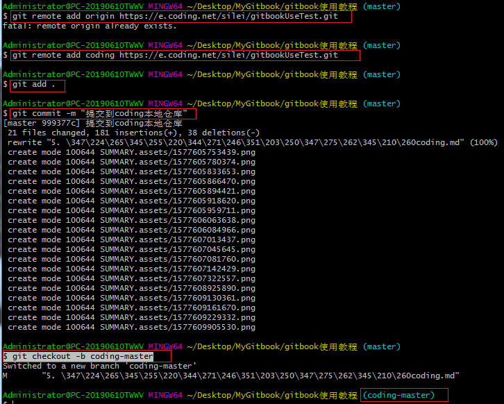
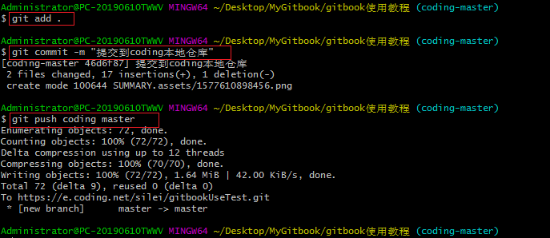
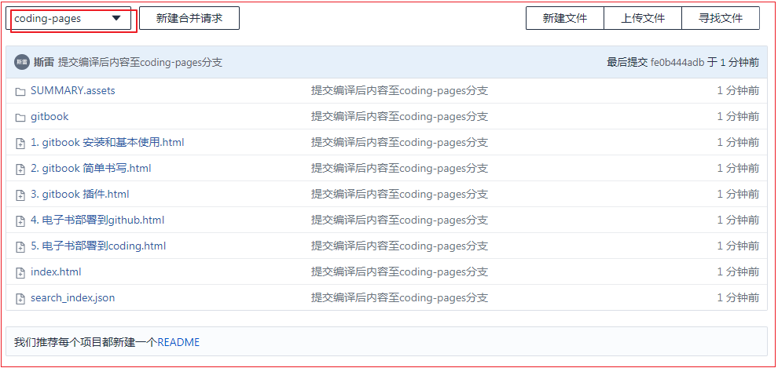
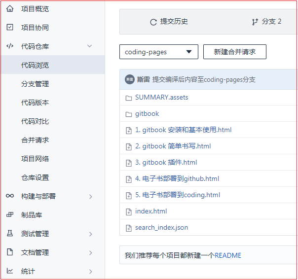

## 5. 电子书部署到coding

> coding 官网：<https://coding.net/>
>
> master 分支保存书籍的源码
>
> coding-pages 分支保存书籍编译后的HTML文件

### 5.1 coding 官网的使用

新建项目：


项目创建成功：


浏览代码，查看关联仓库的命令：

```shell
git remote add origin https://e.coding.net/silei/gitbookUseTest.git
git push -u origin master
```



### 5.2 git上传源代码至coding仓库的master分支

命令如下：

```shell
$ git remote add origin https://e.coding.net/silei/gitbookUseTest.git
fatal: remote origin already exists.	#提示远程的origin已经存在，需要改一下名字

$ git remote add coding https://e.coding.net/silei/gitbookUseTest.git	#改为coding分支

$ git add .		#添加所有文件到本地文件

$ git commit -m "提交到coding本地仓库"

$ git checkout -b coding-master	#新建conding-master分支，并切换至此分支

$ git add .		#重新添加所有文件到本地仓库

$ git commit -m "提交到coding本地仓库"

$ git push coding master	#上传至coding的远程仓库
#coding表示远端仓库，是上面我们取得名字；master表示上传该仓库的具体分支


```





### 5.3 git上传编译后的html页面至coding仓库的coding-pages分支

切换至coding-pages 分支：

```shell
$ git checkout -b coding-pages	#本地新建并切换至coding-pages分支
```

切换分支后，在本地将文件夹中内容清空，然后将gitbook编译后_book中的内容拷贝过来。

然后执行下面的命令：

```shell
$ git add .		#将拷贝过来的文件添加至本地仓库

$ git commit -m "提交编译后内容至coding-pages分支"	#提交至本地仓库

$ git push coding coding-pages	#推送至远程仓库的coding-pages分支
```

完成后可以在远程仓库中的coding-pages分支查看到：



coding中并没有找到`pages服务`，巨坑！



