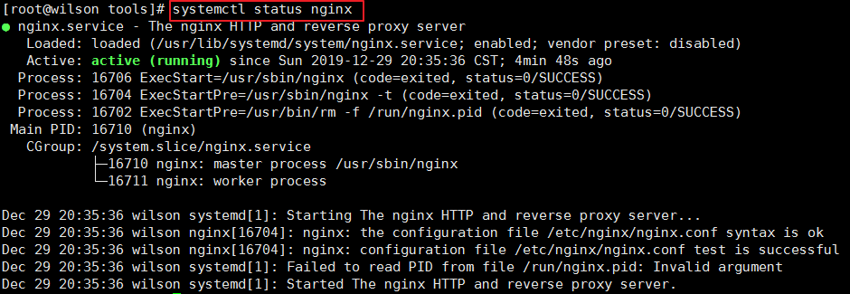
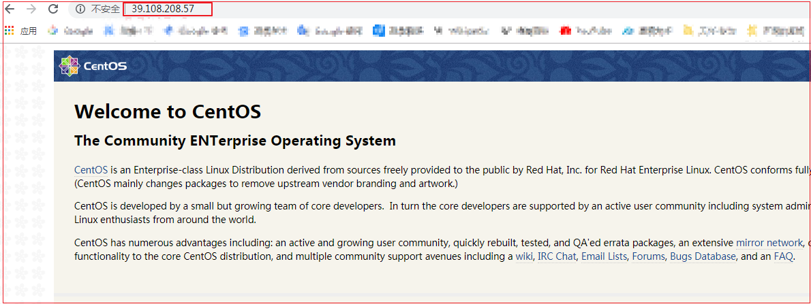
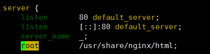
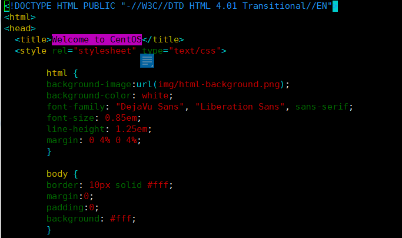
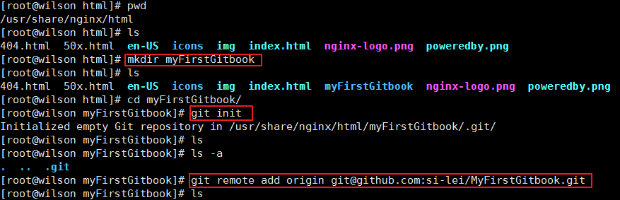
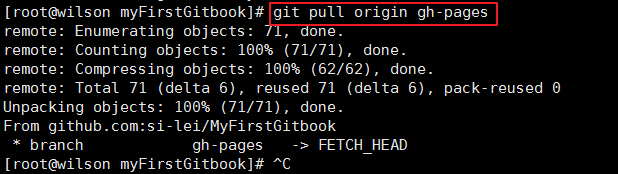
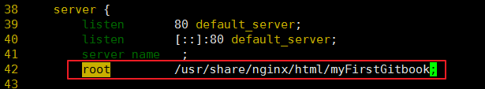
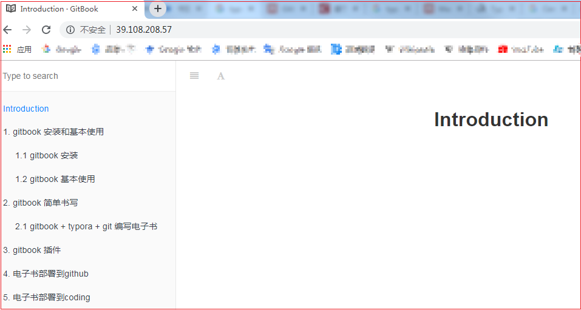

## 6. 将电子书部署到VPS云服务器

> 在VPS上安装 apache 或者 nginx，然后将电子书编译后的HTML文件上传到网站目录下。
>
> 推荐安装nginx

### 6.1 VPS 上安装nginx

安装过程：<https://segmentfault.com/a/1190000018109309>

```shell
#EPEL 仓库中有 Nginx 的安装包,下面命令是安装epel
yum install epel-release

#安装nginx
yum install nginx

#设置nginx开机启动
systemctl enable nginx

#启动nginx
systemctl start nginx

#检查nginx的运行状态
systemctl status nginx
```



本地服务器访问VPS公网ip，出现nginx的欢迎界面：



这里出现的总是CentOS的欢迎界面不知怎么回事！！！

### 6.2 使用git从远程仓库中clone源代码

ECS中下载git并关联远程仓库：

```shell
#服务器安装git
yum install git	

git config --global user.name "si-lei"				#设置git的用户名
git config --global user.email "695171452@qq.com"	#设置git邮箱

#生成git公钥
ssh-keygen -t rsa -C "695171452@qq.com"

#查看生成的公钥，并在远程仓库中添加，进行关联
cat ~/.ssh/id_rsa.pub

#使用git从远程仓库中clone源代码
git clone git@github.com:si-lei/MyFirstGitbook.git
```

查看nginx配置文件中首页的路径：

```shell
#nginx配置文件路径：
/etc/nginx/nginx.conf

#访问nginx时的首页路径：
/usr/share/nginx/html
```



查看nginx的首页文件，发现确实是 Welcome to CentOS，证明前面没有错：

```shell
cd /usr/share/nginx/html
vim index.html
```




在html目录下新建文件，并将gh-pages分支中的内容pull下来：

```shell
cd /usr/share/nginx/html	#进入目录

mkdir myFirstGitbook	#创建文件夹

cd myFirstGitbook/		#进入该文件夹

git init				#初始化本地git仓库

git remote add origin git@github.com:si-lei/MyFirstGitbook.git	#将本地仓库与远程仓库关联

git pull origin gh-pages	#pull远程仓库的gh-pages分支内容
```





修改nginx的配置文件，将访问的首页路径改为上面新建的文件路径：



```shell
#重启ngix:
systemctl restart nginx
```

打开浏览器，刷新之前的VPS ip查看访问内容：



至此，已经将电子书部署到了自己的VPS!

