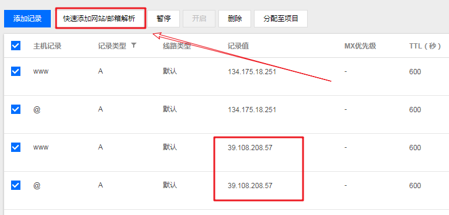
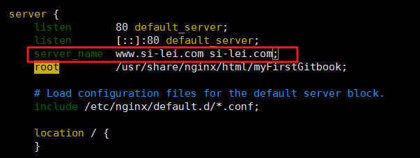
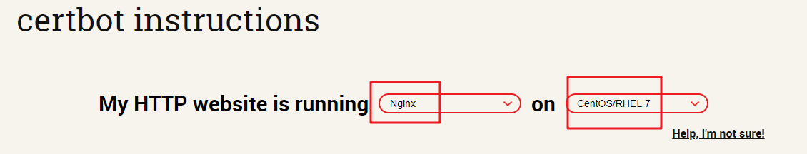
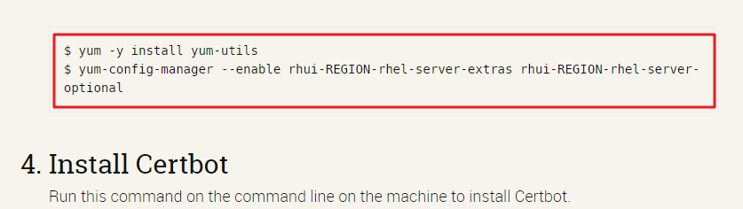

## 7. 将域名绑定到VPS

### 7.1 购买域名

> 此处省略，自行购买。

### 7.2 将域名绑定到github

> 直接将购买的域名添加到page服务的自定义域名中即可。


### 7.3 将域名绑定到coding

> 同上


### 定到VPS并绑定免费SSL证书

首先在域名管理界面，将VPS的ip添加到域名的A记录：



然后修改VPS服务器中的nginx配置文件,将server_name指定到对应的域名:

```shell
vim /etc/nginx/nginx.conf	#修改配置
systemctl restart nginx		#重启nginx
```



**绑定免费SSL证书**

certbot链接：<https://certbot.eff.org/>

打开该网站，选择服务nginx和操作系统:



记住下面的命令：



